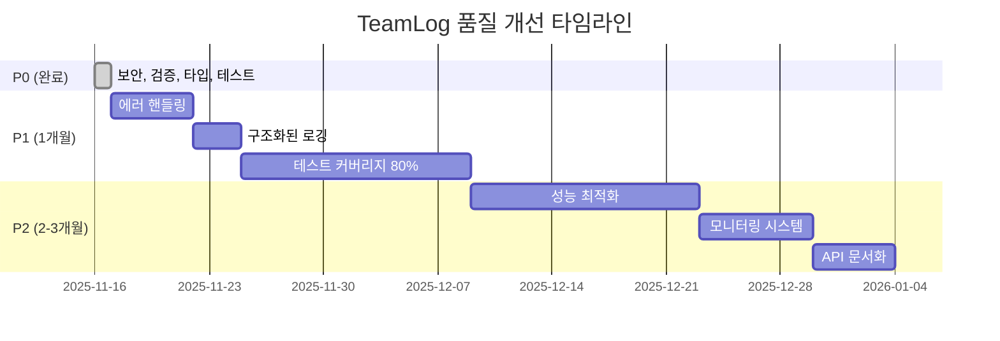

# TeamLog 품질 개선 로드맵

> 본 문서는 TeamLog 프로젝트의 체계적인 품질 개선을 위한 마스터 플랜입니다.

## 📊 현재 상태 (2025-11-16)

### 완료된 작업 ✅
- **P0-1**: CORS 보안 강화 (origin: true → 환경변수 기반)
- **P0-2**: 입력 검증 DTO 작성 (class-validator)
- **P0-3**: any 타입 제거 및 타입 안전성 개선 (7개 → 0개)
- **P0-4**: 테스트 인프라 설정 (Jest, 19 test cases)

### 품질 점수
- **이전**: B+ (78/100)
- **현재**: A- (85/100)
- **목표**: A+ (95/100)

---

## 🎯 P1 우선순위 (1개월 이내)

### P1-1: 에러 핸들링 통일 ⏳
**목표**: 일관된 에러 응답 형식 및 중앙화된 에러 처리

**예상 기간**: 3-5일
**예상 점수 개선**: 에러 핸들링 6/10 → 9/10

**주요 작업**:
- [ ] HTTP Exception Filter 구현
- [ ] 커스텀 Exception 클래스 작성
- [ ] 에러 응답 표준화 (code, message, details)
- [ ] 에러 핸들링 테스트 작성

**참조 문서**: `docs/P1-1-ERROR_HANDLING.md`

---

### P1-2: 구조화된 로깅 ⏳
**목표**: Winston 기반 구조화 로깅 시스템 구축

**예상 기간**: 2-3일
**예상 점수 개선**: 모니터링 5/10 → 7/10

**주요 작업**:
- [ ] Winston logger 설정
- [ ] 로그 레벨 정의 (error, warn, info, debug)
- [ ] 요청/응답 로깅 미들웨어
- [ ] 로그 파일 로테이션 설정
- [ ] 민감 정보 마스킹

**참조 문서**: `docs/P1-2-LOGGING.md`

---

### P1-3: 테스트 커버리지 80% 달성 ⏳
**목표**: 컨트롤러, 가드, 게이트웨이 테스트 추가

**예상 기간**: 1-2주
**예상 점수 개선**: 테스트 6/10 → 9/10

**주요 작업**:
- [ ] 컨트롤러 테스트 (auth, workspace, log, user)
- [ ] 가드 테스트 (JWT, Admin)
- [ ] 게이트웨이 테스트 (Yjs WebSocket)
- [ ] E2E 테스트 시나리오 작성
- [ ] 테스트 커버리지 80% 검증

**참조 문서**: `docs/P1-3-TEST_COVERAGE.md`

---

## 🚀 P2 우선순위 (2-3개월)

### P2-1: 성능 최적화 ⏳
**목표**: 응답 속도 개선 및 데이터베이스 쿼리 최적화

**예상 기간**: 1-2주
**예상 점수 개선**: 성능 7/10 → 9/10

**주요 작업**:
- [ ] Redis 캐싱 레이어 추가
- [ ] N+1 쿼리 문제 해결
- [ ] DB 인덱싱 최적화
- [ ] API 응답 시간 벤치마킹
- [ ] 메모리 프로파일링

**참조 문서**: `docs/P2-1-PERFORMANCE.md`

---

### P2-2: 모니터링 시스템 ⏳
**목표**: 프로덕션 환경 모니터링 및 알림 시스템

**예상 기간**: 1주
**예상 점수 개선**: 모니터링 7/10 → 9/10

**주요 작업**:
- [ ] 헬스체크 엔드포인트 (/health, /ready)
- [ ] Prometheus 메트릭 수집
- [ ] 응답 시간 메트릭
- [ ] 에러율 추적
- [ ] Grafana 대시보드 구성

**참조 문서**: `docs/P2-2-MONITORING.md`

---

### P2-3: API 문서화 ⏳
**목표**: Swagger/OpenAPI 기반 자동 API 문서 생성

**예상 기간**: 3-5일
**예상 점수 개선**: 문서화 8/10 → 10/10

**주요 작업**:
- [ ] @nestjs/swagger 통합
- [ ] DTO에 ApiProperty 데코레이터 추가
- [ ] API 엔드포인트 문서화
- [ ] 예제 요청/응답 추가
- [ ] 인증 플로우 문서화

**참조 문서**: `docs/P2-3-API_DOCS.md`

---

## 🔄 TDD 워크플로우

모든 작업은 다음 순서를 따릅니다:

### 1️⃣ 계획 단계
```bash
# 작업 시작 전
1. 참조 문서 읽기 (docs/P*-*.md)
2. 유저 시나리오 정의
3. 인터페이스/타입 설계
```

### 2️⃣ 테스트 작성 (Red)
```bash
# 테스트 먼저 작성
npm run test:watch

# 예상 결과:
# - 모든 테스트 FAIL (아직 구현 안 함)
```

### 3️⃣ 구현 (Green)
```bash
# 최소한의 코드로 테스트 통과
npm test

# 예상 결과:
# - 모든 테스트 PASS
```

### 4️⃣ 리팩토링 (Refactor)
```bash
# 코드 개선 (테스트는 계속 통과)
npm test
```

### 5️⃣ 검증 체크리스트 ✅
```bash
# 다음 태스크로 넘어가기 전 필수
npm run build         # TypeScript 컴파일 성공
npm run lint          # ESLint 에러 없음
npm test              # 모든 테스트 통과
npm run test:cov      # 커버리지 확인
```

---

## 📈 예상 일정



**주요 마일스톤**:
- 🎯 **Week 1** (11/17-11/23): P1-1 에러 핸들링 완료
- 🎯 **Week 2** (11/24-11/30): P1-2 로깅 + P1-3 테스트 시작
- 🎯 **Week 3-4**: P1-3 테스트 커버리지 80% 달성
- 🎯 **Month 2-3**: P2 최적화 및 모니터링

---

## 📚 문서 구조

```
/home/user/team-log/
├── QUALITY_IMPROVEMENT_ROADMAP.md  (본 문서)
├── docs/
│   ├── TDD_WORKFLOW.md              # TDD 워크플로우 가이드
│   ├── VALIDATION_CHECKLIST.md      # 검증 체크리스트
│   ├── P1-1-ERROR_HANDLING.md       # 에러 핸들링 상세 플랜
│   ├── P1-2-LOGGING.md              # 로깅 상세 플랜
│   ├── P1-3-TEST_COVERAGE.md        # 테스트 커버리지 플랜
│   ├── P2-1-PERFORMANCE.md          # 성능 최적화 플랜
│   ├── P2-2-MONITORING.md           # 모니터링 플랜
│   └── P2-3-API_DOCS.md             # API 문서화 플랜
└── backend/
    └── src/
```

---

## 🎓 학습 자료

### 에러 핸들링
- [NestJS Exception Filters](https://docs.nestjs.com/exception-filters)
- [Best Practices for Error Handling](https://www.rfc-editor.org/rfc/rfc7807)

### 로깅
- [Winston Documentation](https://github.com/winstonjs/winston)
- [NestJS Logger](https://docs.nestjs.com/techniques/logger)

### 테스팅
- [NestJS Testing](https://docs.nestjs.com/fundamentals/testing)
- [Jest Best Practices](https://github.com/goldbergyoni/javascript-testing-best-practices)

### 성능
- [Node.js Performance Best Practices](https://nodejs.org/en/docs/guides/simple-profiling)
- [Database Indexing Strategies](https://www.postgresql.org/docs/current/indexes.html)

---

## 💡 다음 액션

```bash
# 1. P1-1 에러 핸들링 시작
cd /home/user/team-log
cat docs/P1-1-ERROR_HANDLING.md

# 2. TDD 워크플로우 확인
cat docs/TDD_WORKFLOW.md

# 3. 검증 체크리스트 준비
cat docs/VALIDATION_CHECKLIST.md
```

**현재 진행할 태스크**: P1-1 에러 핸들링 통일

---

*Last Updated: 2025-11-16*
*Current Score: A- (85/100)*
*Target Score: A+ (95/100)*
